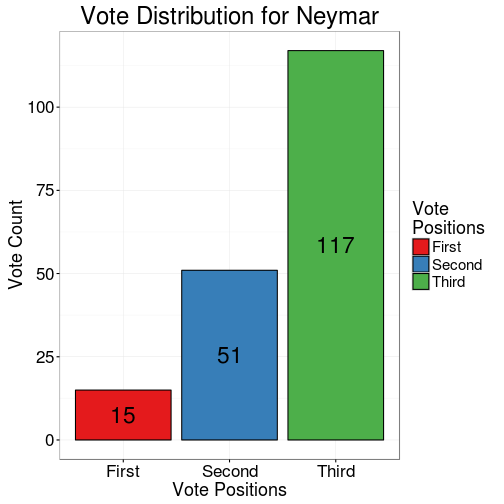

## About this project
This project provides a comparison of votes casted for FIFA Ballon d'Or Men 2015. The data used is availabe at
[FIFA.com](http://www.fifa.com/ballon-dor/official-documents/index.html).  
A brief How-to is provided in application for those who aren't aware of FIFA Ballon d'Or voting procedure. FIFA uses preferential voting with points divided between ranks.
Application can handle 3 types of comparisons:
* First comparison type is "**All Players**". It displays a plot comparing all nominees. Options for selecting players which have collected votes within a range can also be selected using options.
* Second comparison type is "**Two Players**". Options are selecting two players. Any two nominees can be compared using this comparison type.
* Last comparison type is "**One Player**". Option allows choosing the players whose stats user wishes to know. A plot showing distribution of player's votes appear.

Selecting comparison type renders further option(s) available for that comparison type. Barplot (stacked/side-by-side) is generated based on comparison type and options. Color Coding has been used to differentiate voting choices (1st, 2nd and 3rd).

--- .class #id
## Data

```r
str(playerwise_men) # data frame of men votes
```

```
## 'data.frame':	23 obs. of  5 variables:
##  $ player_name: chr  "Agüero Sergio" "Bale Gareth" "Benzema Karim" "Cristiano Ronaldo" ...
##  $ First      : num  1 4 1 97 2 1 3 5 0 14 ...
##  $ Second     : num  7 1 4 226 2 12 7 4 2 23 ...
##  $ Third      : int  12 6 1 57 5 17 11 12 7 45 ...
##  $ total      : num  20 11 6 380 9 30 21 21 9 82 ...
```
Next slide shows a snippet of `server.R` which generates dynamic UI.

--- .class #id
## Dynamic UI

```r
output$radioButtonControls <- renderUI({
        # Selects UI based on input type
        if(input$action_type == "one"){ # For one player option
            wellPanel(
                playerselect_block # selectInput Block
            )
        }else if(input$action_type == "two"){ # For two players option
            wellPanel(
                playercomparison1_block, # selectInput Block
                playercomparison2_block # selectInput Block
            )
        }else{ # For all players option
            wellPanel( # 3 sliderInput Blocks
                min_5pts, min_3pts, min_1pts
            )
        }
    })
```

---&twocol
## Plot: Examples

*** {name: left}


*** {name: right}



